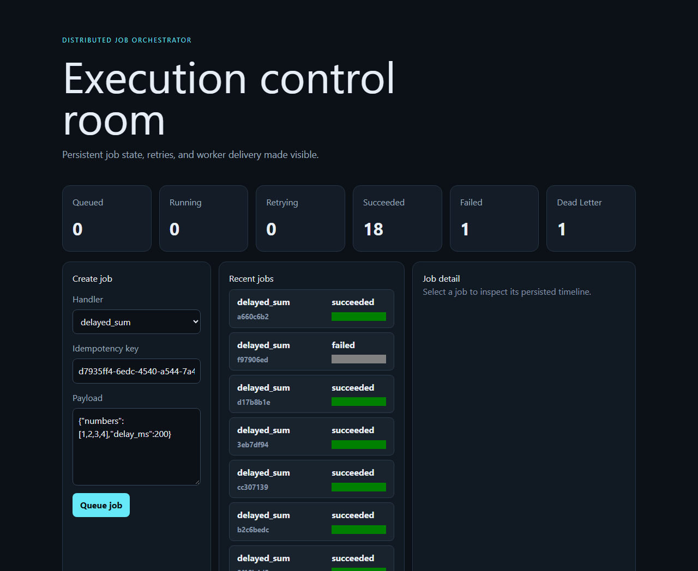
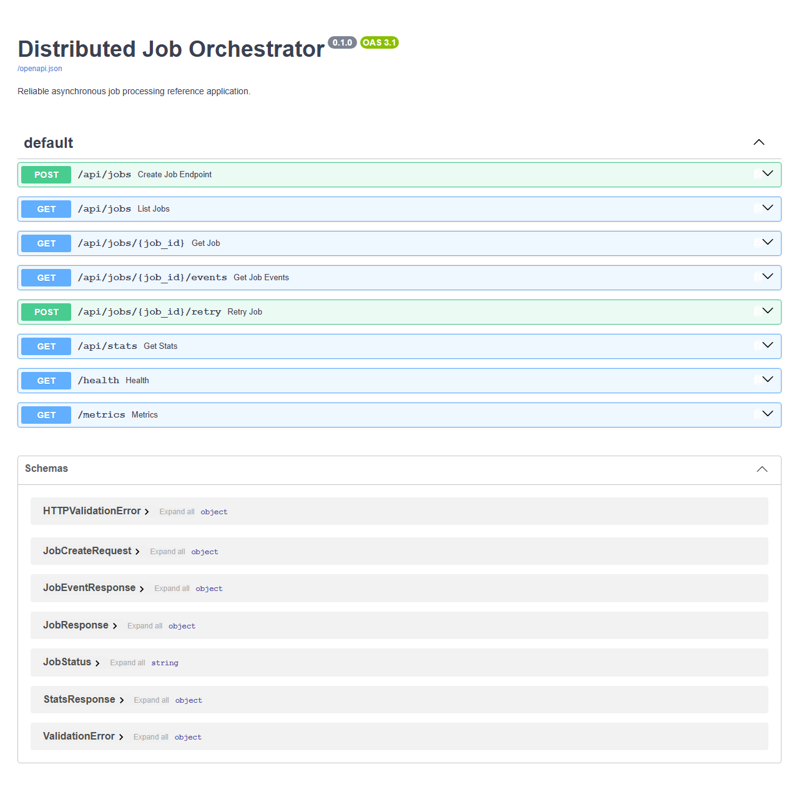
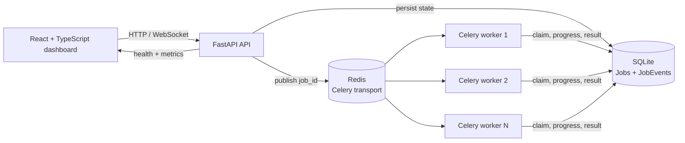

# Distributed Job Orchestrator

[](https://github.com/PdrPaez/distributed-job-orchestrator/actions/workflows/ci.yml)

Distributed Job Orchestrator is a local-first job processing platform for submitting, executing, observing, and recovering asynchronous work with explicit delivery semantics.

It combines FastAPI, Celery, Redis, SQLite, and a React dashboard. SQLite is the durable source of truth for jobs and their event timelines; Redis transports Celery messages; workers reload authoritative state before claiming work. The result is a small system that is easy to run locally while still making retries, duplicate delivery, persistence, and operator recovery visible.

## Product capabilities

- **Three built-in job types:** delayed numeric aggregation, deterministic batch transformation, and an intentionally unstable retry demonstration.
- **Database-backed idempotency:** repeated submissions with the same key return the same Job and create only one durable record.
- **Explicit lifecycle:** `queued`, `running`, `retrying`, `succeeded`, `failed`, and `dead_letter` states with validated transitions.
- **At-least-once execution:** late acknowledgements, guarded worker claims, terminal duplicate protection, and SQLite-backed coordination.
- **Automatic recovery:** bounded attempts, exponential backoff, retryable failures, dead-letter state, and explicit manual retry.
- **Progress and timelines:** persisted progress percentages plus ordered `JobEvent` records for every important transition.
- **Live operations dashboard:** job creation, filters, statistics, details, event timeline, progress, result, errors, and reconnecting WebSocket updates.
- **Operational visibility:** structured JSON logs, health checks, durable Prometheus metrics, job durations, and broker/database status.
- **Quality gates:** backend tests and Ruff, frontend TypeScript validation and production build, npm audit, CI, and a real Redis/Celery smoke test.

## Screenshots

The dashboard exposes the operational state of the orchestrator at a glance: queue pressure, worker outcomes, recent jobs, and the job creation workflow.



The API reference is available through the generated OpenAPI interface and documents the endpoints used by the dashboard and worker workflow.



## Architecture



### Source of truth and delivery model

The API validates the request and commits a complete Job record before publishing only its UUID to Celery. A worker reloads the payload from SQLite, claims the job with a conditional update, executes the registered handler, and persists progress and the final outcome.

Redis is transport infrastructure, not the domain database. Celery uses late acknowledgements and a prefetch multiplier of one. A duplicate delivery can therefore reach the same worker or another worker, but only one conditional claim succeeds and terminal jobs are ignored. Exactly-once execution is not claimed; handlers and consumers must remain safe under at-least-once delivery.

The WebSocket endpoint polls SQLite for changed snapshots instead of introducing a second UI message bus. Metrics are derived from durable Job and JobEvent rows at scrape time, so a process restart does not erase the operational view.

## Job lifecycle

```text
queued -> running -> succeeded
                 -> retrying -> running
                 -> failed
                 -> dead_letter
failed/dead_letter -> queued (manual retry)
```

Automatic attempts use a default budget of three executions. Retryable failures use short exponential backoff (`1s`, `2s`, ...); the final automatic failure becomes `dead_letter`. Manual retry is an explicit operator action that preserves the Job ID, idempotency key, cumulative attempt count, and event history.

## Repository layout

```text
backend/
  app/api/              HTTP, WebSocket, schemas, health, and metrics routes
  app/database/         SQLite engine and session configuration
  app/jobs/              handlers, service operations, and lifecycle rules
  app/models/            Job and JobEvent persistence models
  app/observability/     structured logging configuration
  app/worker/            Celery application and task entrypoint
  tests/                 lifecycle, concurrency, API, WebSocket, and recovery tests
frontend/
  src/                   React dashboard and browser-side API/WebSocket behavior
docs/                    architecture, lifecycle, and design decisions
scripts/                 real-system smoke test
.github/workflows/       continuous integration checks
```

## Requirements

- Python 3.12+
- Node.js 20+
- npm
- Redis 7+ running locally on `localhost:6379`

The application intentionally uses a real Redis server for broker validation. The automated backend suite does not replace broker behavior with an in-process mock.

## Installation

### Windows PowerShell

```powershell
git clone https://github.com/PdrPaez/distributed-job-orchestrator.git
cd distributed-job-orchestrator

python -m venv backend\.venv
backend\.venv\Scripts\Activate.ps1
python -m pip install --upgrade pip
python -m pip install -e ".\backend[dev]"

cd frontend
npm ci
```

Install Redis using the package manager or local service appropriate for the machine, then verify it before starting the application:

```powershell
redis-cli ping
# PONG
```

### macOS or Linux

```bash
git clone https://github.com/PdrPaez/distributed-job-orchestrator.git
cd distributed-job-orchestrator

python3 -m venv backend/.venv
source backend/.venv/bin/activate
python -m pip install --upgrade pip
python -m pip install -e './backend[dev]'

cd frontend
npm ci
```

Start Redis with the service manager for the operating system and verify it with `redis-cli ping`.

To override the local defaults, copy the repository example into the backend directory before starting the API:

```powershell
Copy-Item .env.example backend/.env
```

## Run locally

Use separate terminals from the repository root.

### Backend API

```bash
cd backend
python -m uvicorn app.main:app --reload --host 127.0.0.1 --port 8000
```

### Workers

Run one or more workers. Separate worker names make the multi-worker behavior easy to inspect:

```bash
cd backend
python -m celery -A app.worker.celery_app worker --loglevel=INFO --concurrency=1 --hostname=worker1@%h
python -m celery -A app.worker.celery_app worker --loglevel=INFO --concurrency=1 --hostname=worker2@%h
```

On Windows, if the default process pool is unavailable, add `--pool=solo` to each worker command. This still runs independent Celery worker processes against the same Redis broker and SQLite database.

### Dashboard

```bash
cd frontend
npm run dev
```

Open `http://127.0.0.1:5173`. The API is available at `http://127.0.0.1:8000`, Swagger UI at `/docs`, health at `/health`, and Prometheus metrics at `/metrics`.

## Using the dashboard

1. Open the dashboard and choose one of the three supported job types.
2. Enter a payload and, optionally, an idempotency key.
3. Submit the job and watch the status, progress, and timeline update live.
4. Open the detail view to inspect attempts, duration, result, error, and ordered events.
5. For a failed or dead-lettered job, use **Manual retry** and observe the cumulative attempt count.

## Job examples

### Delayed sum

```powershell
$body = @{
  type = "delayed_sum"
  payload = @{ numbers = @(1, 2, 3, 4); delay_ms = 200 }
  idempotency_key = "demo-sum-1"
} | ConvertTo-Json

Invoke-RestMethod -Method Post -Uri http://127.0.0.1:8000/api/jobs `
  -ContentType "application/json" -Body $body
```

The result is `{"sum":10,"items_processed":4}` and progress is persisted during execution.

### Batch transform

```json
{
  "type": "batch_transform",
  "payload": { "items": ["alpha", "beta"] }
}
```

Each item returns its uppercase output and a deterministic twelve-character SHA-256 checksum.

### Retry and dead-letter demonstration

```json
{
  "type": "unstable_demo",
  "payload": { "fail_until_attempt": 2 }
}
```

The job fails on automatic attempt one, schedules a retry, and succeeds on attempt two. With `fail_until_attempt: 4`, attempts one through three exhaust the automatic budget and move the job to `dead_letter`; a manual retry then succeeds on cumulative attempt four.

## API reference

| Method | Route | Purpose |
| --- | --- | --- |
| `GET` | `/health` | Database and Redis health status |
| `POST` | `/api/jobs` | Validate, persist, and enqueue a job |
| `GET` | `/api/jobs` | List jobs with optional status/type filters |
| `GET` | `/api/jobs/{id}` | Read the current Job state |
| `GET` | `/api/jobs/{id}/events` | Read the ordered JobEvent timeline |
| `POST` | `/api/jobs/{id}/retry` | Manually retry a failed/dead-lettered job |
| `GET` | `/api/stats` | Durable counts by lifecycle state |
| `GET` | `/metrics` | Prometheus-compatible metrics |
| `WebSocket` | `/ws/jobs/{id}` | Stream changed Job snapshots |

Example idempotent submission:

```bash
curl -X POST http://127.0.0.1:8000/api/jobs \
  -H 'Content-Type: application/json' \
  -d '{"type":"delayed_sum","payload":{"numbers":[1,2,3]},"idempotency_key":"same-request-1"}'
```

Submitting the same request again with `same-request-1` returns the existing Job instead of creating another one.

## Configuration

The backend reads environment variables from `backend/.env`. Copy `.env.example` when custom values are needed; defaults support local execution.

| Variable | Default | Description |
| --- | --- | --- |
| `DATABASE_URL` | `sqlite:///./data/jobs.db` | SQLite database location |
| `REDIS_URL` | `redis://localhost:6379/0` | Redis health-check connection |
| `CELERY_BROKER_URL` | `redis://localhost:6379/0` | Celery transport connection |
| `CELERY_RESULT_BACKEND` | `redis://localhost:6379/1` | Celery result backend connection |
| `DEFAULT_MAX_ATTEMPTS` | `3` | Automatic attempt budget |
| `WEBSOCKET_POLL_INTERVAL_MS` | `500` | WebSocket polling interval |
| `CORS_ORIGINS` | `http://localhost:5173` | Allowed browser origins |

## Validation

### Automated checks

```bash
cd backend
python -m ruff check .
python -m pytest -q

cd ../frontend
npm run lint
npm run build
npm audit --audit-level=high
```

### GitHub delivery flow

Every push and pull request runs the GitHub Actions CI workflow. It validates the backend with Ruff and pytest, builds and audits the frontend, and executes the real API/Redis/worker smoke flow. After a successful `main` run, the CD workflow packages the backend source, frontend production bundle, README, changelog, and license as a downloadable GitHub Actions artifact.

### Real distributed smoke test

With Redis, the API, and at least one worker running from the repository root:

```bash
python scripts/smoke_test.py
```

The smoke test verifies health, idempotent submission, delayed sum, batch transform, event ordering, unstable retries, dead-letter recovery, cumulative attempts, and Prometheus metrics.

The completed live validation also covered:

- three independent Celery workers receiving jobs from the same Redis broker;
- nine concurrent delayed jobs completing successfully across the workers;
- real WebSocket snapshots from `running` through `succeeded`;
- SQLite Job state surviving an API restart;
- a Redis outage returning HTTP 503 instead of silently leaving a permanently queued job;
- recovery of the broker-failed job after Redis restarted.

## Engineering decisions and limitations

- SQLite is the durable domain source of truth and is configured for WAL, foreign keys, a busy timeout, short transactions, and process-safe connections.
- Redis carries Celery messages; it does not store authoritative job state.
- Celery messages carry only `job_id`, keeping payload ownership in SQLite.
- There is no transactional outbox. If broker publication fails after the Job commit, the API records a visible failed state and enqueue-failure event.
- WebSockets poll SQLite rather than adding a second message bus for the UI.
- Dead-letter is an application state, not a separate queue product.
- The three handlers are explicit and do not execute arbitrary code.
- Authentication, multi-tenant isolation, workflow DAGs, cron scheduling, event sourcing, CQRS, and production high-availability infrastructure are intentionally outside the project scope.

## Development workflow

Use short-lived branches and integrate validated work into `dev` before promoting to `main`:

```text
feature/* or fix/* -> dev -> main
```

Commit messages use:

```text
[AREA][DJO-XXX] concise English description
```

Before promotion, run backend tests and Ruff, frontend lint and build, inspect the diff, verify that no runtime database or secret is tracked, and execute the real Redis smoke flow.

## License

Released under the MIT License. See [LICENSE](LICENSE).
